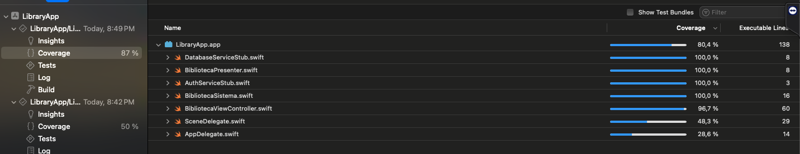
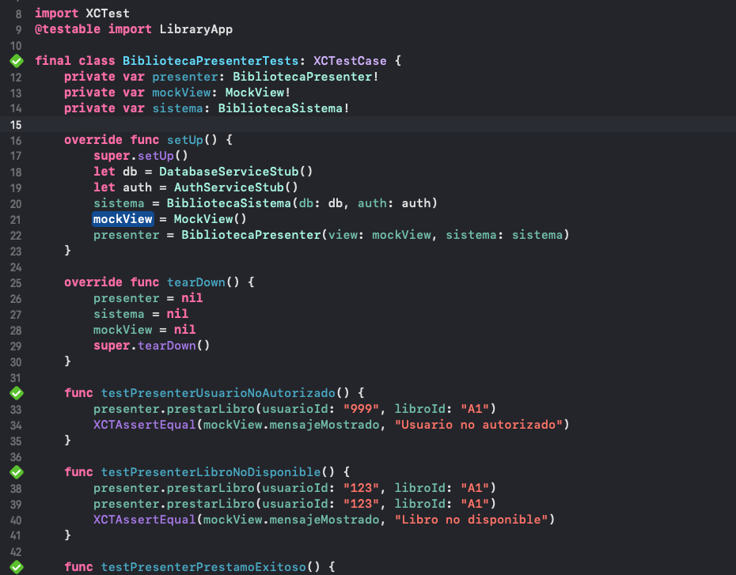
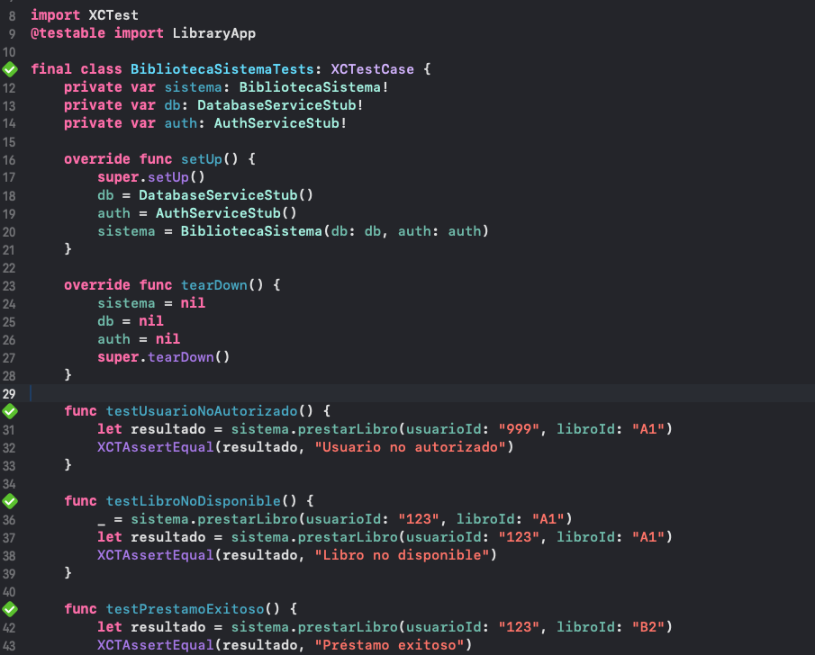

# 📱 LibraryApp

Una aplicación iOS simple para gestionar una biblioteca utilizando la arquitectura **MVP**.  
Permite **buscar, pedir libros**, con validaciones y soporte de tests unitarios, de integración y de UI.

---

## 🛠️ Lenguaje y versión usados
- **Lenguaje:** Swift 5.9  
- **Framework:** UIKit  
- **Arquitectura:** MVP (Model-View-Presenter)  
- **Compatibilidad:** iOS 16+  
- **IDE:** Xcode 15+  

---

## 📦 Instrucciones de instalación
1. Clonar el repositorio:
   ```bash
   git clone https://github.com/CarlosMantillaC/LibraryApp.git
   cd LibraryApp
   ```

2. Abrir el proyecto en Xcode:
   ```bash
   open App.xcodeproj
   ```

3. Seleccionar un simulador o dispositivo físico.

4. Ejecutar la app con:
   ```
   Cmd + R
   ```

---

## 🧪 Cómo ejecutar los tests

### Tests de integración (presenter)
1. En Xcode, ir a la pestaña **Test Navigator (⌘ + 6)**.  
2. Ejecutar la suite:
   - `BibliotecaPresenterTests`

### Tests de UI
1. Ejecutar la suite:
   - `LibraryAppUITests` → Simula interacción real del usuario.
2. También puedes correr todos los tests con:
   ```bash
   Cmd + U
   ```

---

## 🖼️ Capturas de pantalla

### Cobertura del código probado


### Código de la suite de BibliotecaPresenterTests


### Código de la suite de BibliotecaSistemaTests


### Código de la suite de BibliotecaUITests

